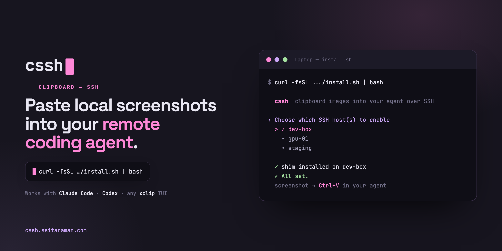

<p align="center">
  
</p>

<h1 align="center">cssh</h1>

<p align="center">
  <b>Paste local clipboard images into your remote coding agent over SSH.</b><br>
  Screenshot on your laptop, press <kbd>Ctrl</kbd>+<kbd>V</kbd> in a remote session — works with
  <b>Claude Code</b>, <b>Codex</b>, or any terminal app that reads <code>xclip</code>.
</p>

<p align="center">
  <a href="https://cssh.ssitaraman.com"><b>cssh.ssitaraman.com</b></a>
</p>

---

Your agent runs on a remote box and reads the *remote's* clipboard, so a normal
paste never sees the screenshot sitting in your *laptop's* clipboard. `cssh`
bridges the two.

## Install

One line, on your laptop:

```bash
curl -fsSL https://raw.githubusercontent.com/Hackerbone/cssh/main/install.sh | bash
```

The installer reads `~/.ssh/config`, lets you pick which host(s) to enable (or
add a new one), and sets everything up on both ends. Zero runtime dependencies
beyond `bash` and `ssh`. It uses [`gum`](https://github.com/charmbracelet/gum)
for the menus when available, and falls back to a clean built-in menu otherwise.

## Usage

1. Copy or screenshot an image.
2. **Daemon mode:** nothing to do. **Hotkey mode:** press your bound key.
3. In Claude Code on the remote, press <kbd>Ctrl</kbd>+<kbd>V</kbd>.

Bind the hotkey to `~/.cssh/bin/cssh-push` with Raycast, Hammerspoon, macOS
Shortcuts, or Karabiner.

## How it works

Claude Code reads pasted images on Linux by shelling out to `xclip` (verified
against the Claude Code binary):

```
xclip -selection clipboard -t TARGETS   -o    # is an image available?
xclip -selection clipboard -t image/png -o    # give me the PNG
```

- **Remote** — a tiny `xclip` shim, placed ahead of the real one on `PATH`. When
  a fresh image is waiting at `~/.cssh/latest.png` it serves it to those calls;
  otherwise it delegates to the real `xclip`. The image is one-shot (served once,
  then deleted) with a TTL guard, so your next paste is normal text. No X server,
  no Xvfb, no OSC 52.
- **Local** — reads the image from your OS clipboard (macOS `osascript`, Wayland
  `wl-paste`, X11 `xclip`, Windows PowerShell) and ships the bytes to the remote
  over a multiplexed SSH connection (a warm socket, so pushes are near-instant).

Two ways to trigger the push, chosen at install — use either or both:

- **Daemon** — auto-syncs every new clipboard image. Just screenshot, then paste.
- **Hotkey** — runs `cssh-push` on demand.

## Codex support

Codex is different: it reads the clipboard through `arboard`, which talks **X11
directly** — it never runs the `xclip` binary, so the shim can't reach it. On a
headless box arboard just times out (`X11 server connection … unreachable`).

To bridge Codex, cssh can run a tiny **headless X server** (Xvfb) on the remote
and keep its clipboard loaded with the image you synced, so Codex has a real X
clipboard to paste from:

```bash
# during install, answer "yes" to "Also use Codex?"  — or enable it later:
curl -fsSL https://raw.githubusercontent.com/Hackerbone/cssh/main/install.sh | bash -s -- --codex <host>
```

This installs `Xvfb` + `xclip` on the remote (needs a package manager and
passwordless `sudo`, or install them yourself), starts a supervisor that owns
the X clipboard, and adds `export DISPLAY=127.0.0.1:99` to your remote shell rc.
The DISPLAY uses the **TCP loopback** form on purpose — Codex's sandbox blocks
the `/tmp/.X11-unix` socket. Relaunch Codex afterward so it picks up `DISPLAY`.

> Trade-off: this is the one path that puts an X server on the remote. Claude
> Code stays completely X-free; Codex support is opt-in.

## Configuration

| Setting | Location | Default |
| --- | --- | --- |
| Default push target | `~/.cssh/config` → `REMOTE` | chosen at install |
| Per-push override | `cssh-push <host>` | — |
| Image TTL (remote) | `~/.cssh/ttl` (seconds) | `300` |
| Daemon poll interval | `CSSH_POLL_SECONDS` | `1` |

## Requirements

- **Laptop** — macOS, Linux (X11/Wayland), or Windows via WSL/Git-Bash; `bash` + `ssh`.
- **Remote** — any Linux box you SSH into; the shim needs only `bash`, `stat`, `date`.
- **Remote, for Codex** — additionally `Xvfb` + `xclip` (auto-installed with
  passwordless `sudo`, or install them yourself).

## Uninstall

One line — the mirror of install. It removes the remote shim (and its `PATH`
line), the local `~/.cssh`, the login daemon, and every `# cssh` block from
`~/.ssh/config` (backing the file up to `~/.ssh/config.cssh.bak` first):

```bash
curl -fsSL https://raw.githubusercontent.com/Hackerbone/cssh/main/install.sh | bash -s -- --uninstall
```

Add `--yes` to skip the confirmation. Any offline host is reported so you can
clean it later; everything on your laptop is removed regardless.

## License

MIT
